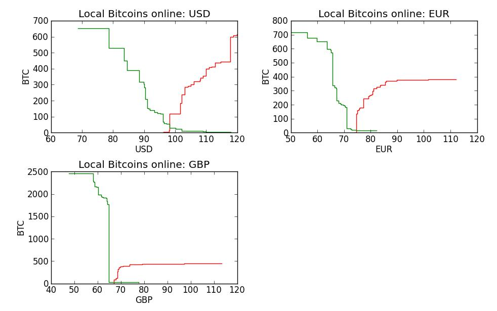

#local-bitcoins-api
==================

Developed by Bots of Bitcoin
v0.1 - Release candidate

##Purpose

This package contains:
- `lb_api.py` slightly extended wrapper for the Local Bitcoins API based on that provided by Local Bitcoins and providing some additional functions via HTML where required
- `okpay_api.py` a complete wrapper for the OKPay API including a facility for Bitcoin payments
- `listener.php` PHP code to act as a gatekeeper on the server, verifying whether a payment notification really came from OKPay
- `listener.py` a listener to receive payment notifications from OKPay's instant payment notification (IPN) system and release escrows on Local Bitcoins
- `market_depth.py` a bonus command line tool to visualise the current depth of the Local Bitcoins market in various countries and currencies

##Tests status

_Local Bitcoins API_
- all functions have been tested on live accounts

_OKPay API_
- all functions have been tested on live accounts

_OKPay Listener_
- PHP file is tested and working
- Python file is fully tested on live accounts and releases transactions as expected

_Local Markets Depth_
- tested but will have additional features added

##Local Bitcoins API

The `lb_api.py` module implements all the existing functionality of the official Local Bitcoins API (see [the API docs](https://localbitcoins.com/api-docs/) for details):
- `get_escrows()`
- `release_escrow(escrow)`
- `get_ads()`
- `edit_ad(ad_id, ad_id, visibility, min_amount, max_amount, price_equation)`

In addition the following functions have been added (unofficial and so may be deprecated without warning):
- `update_prices(price_equation, trade_type)` - Updates all price equations for ads of a given type. Returns an array of responses from each call of the `edit_ad` function
- `delete_ad(ad_id)` - Unofficial API function for deleting an ad by passing the ad_id number
- `delete_ads(start, end)` - Unofficial API function for deleting multiple ads from a start ad_id number (default 0) to an end ad_id number (default 'inf'). Returns an array of responses in the form `{'success': [1 or 0][, 'deleted_id': ad_id, 'error': error]}`
- `edit_ad_html(ad_id, edits_dict)` - Unofficial API function for editing aspects of ads not yet covered by the official API. Pass in an ad ID number and a dictionary of field names to edit. These can be found by viewing the source of the edit ad page and are in the form `ad-field_name`.  

##OKPay API

The `okpay_api.py` module implements the API from OKPay and can be used by anyone who wants to integrate their Local Bitcoins app with OKPay's payment system. These functions are taken directly from the API.
- `get_date-time()`
- `get_balance()`
- `send_money(destination, currency, amount, comment, receiver_pays_fees)`
- `check_account(destination)`
- `get_transaction(transaction, invoice)`
- `get_history(start, end, page_size, page_num)`
- `withdraw_to_ecurrency(payment_method, pay_system_account, amount, currency, fees_from_amount, invoice)`
- `get_withdrawal_fee(payment_method, amount, currency, fees_from_amount)`

In addition, the following functions have been added/extended:
- `get_balance(currency)` - By default, the OKPay `get_balance` function returns details of all wallets. You can also now pass a three-letter currency code to get just that wallet's balance.
- `withdraw_to_BTC(bitcoin_wallet, amount, currency, fees_from_amount=True)` - Used to simplify Bitcoin withdrawals and returns the same as `withdraw_to_ecurrency`.

##OKPay Listener

The `listener.php` waits for a message from OKPay, checks it is a valid message from  OKPay and passes it on to `listener.py`.

The `listener.py` module implements OKPay's instant payment notification (IPN) system, checking a message applies to a real transaction that hasn't already been dealt with, and then invokes the `release_escrow` function from `lb_api`.

The only public function is:
- `set_creds(lb_username, lb_password, lb_client_id, lb_client_secret, okpay_wallet, okpay_email, okpay_key, okpay_client)`, used to set all authorisation parameters.

##Market Depth

The `market_depth` module pulls prices and available volumes from Local Bitcoins and plots them

##Setup and usage
To use the API modules:
- Set up Local Bitcoins API [here](https://localbitcoins.com/accounts/api/)
- Set up OKPay API [here](https://www.okpay.com/en/developers/interfaces/setup.html)
- Add credentials to the two API files, or alternatively call them using the necessary credentials
- You can add all credentials to a file on your server by calling `set_creds`
	
_Optional_ if the OKPay IPN module is required
- Set up OKPay instant payment notifications (if required) - [instructions](https://www.okpay.com/en/developers/ipn/setup.html)
- Install the package on your server
- Start the listener by running `listener.py`

_Market Depth_ module
- Call from the command line with a list of countries and/or currencies
- Currently supports UK, USA, GERMANY, ITALY, SPAIN, AUSTRALIA, ARGENTINA, NETHERLANDS, BRAZIL, FRANCE, GBP, USD, EUR
- example: `$ python market_depth.py USD GBP EUR`

##Requirements
- `Python 2.7`

- `requests`

- `suds` for OKPay API and listener only

- `bs4` (BeautifulSoup) required for market depth and for editing ads using the `edit_ads_html` function

- `matplotlib` for market depth only

*Donations gratefully accepted at 13aHXq1uvusPrAAtmrrggkckBFC5WLFgXo*
